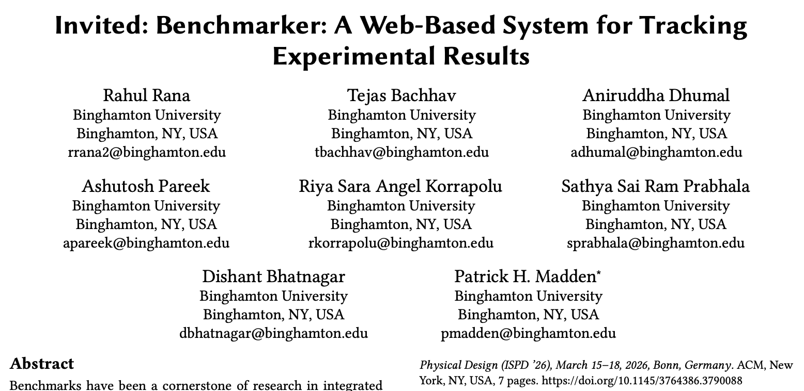
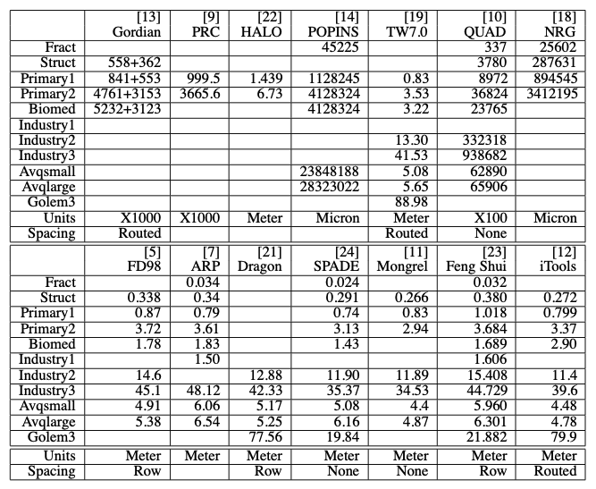
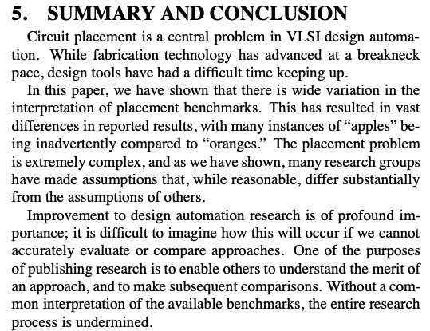
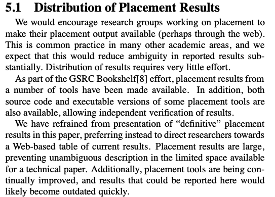
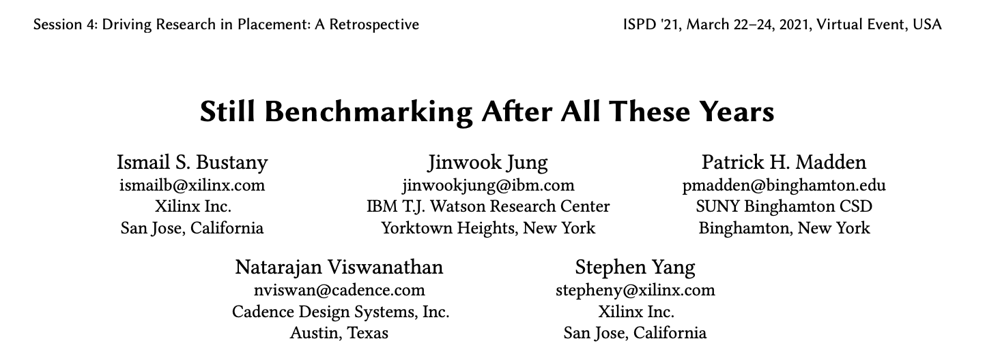
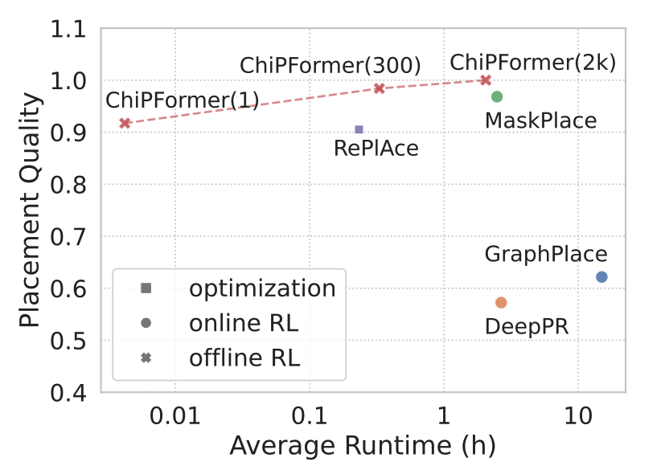
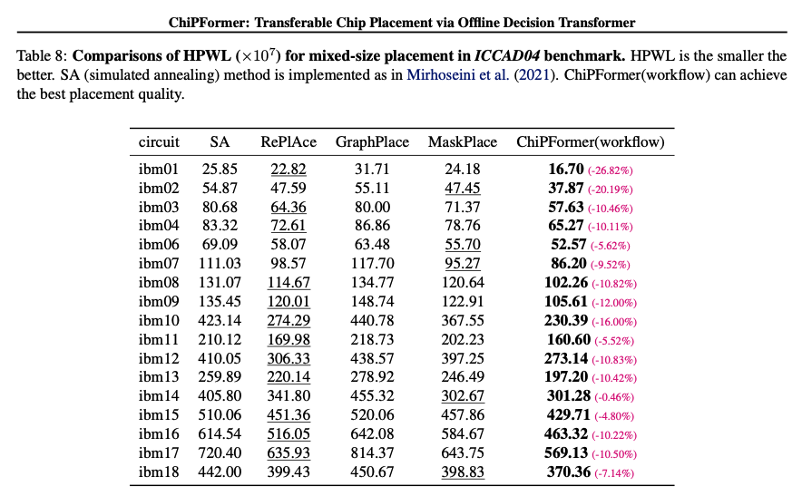
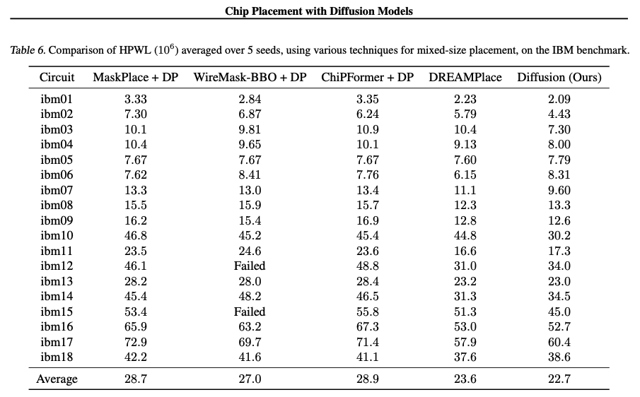
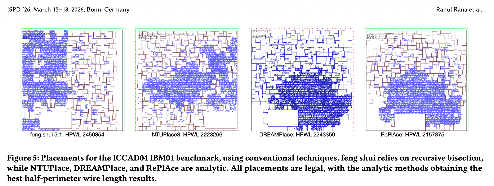
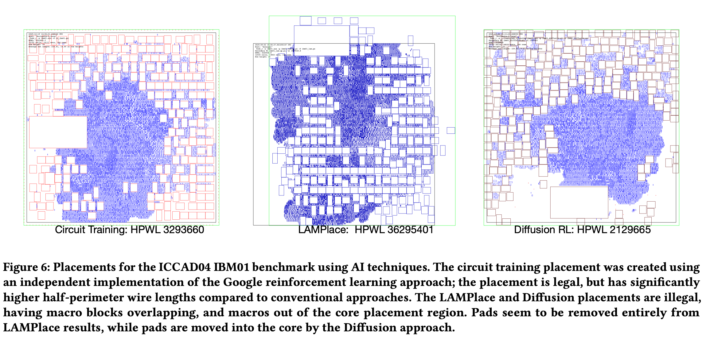

theme: Plain Jane, 0
autoscale: true
slidenumbers: true
footer: Patrick H. Madden/Benchmarker UTDA Talk, 20260213/Binghamton School of Computing

# Benchmarker

## Patrick H. Madden/Binghamton University School of Computing
### pmadden@binghamton.edu

---

---

# Background

More than twenty-five years ago, I started working on circuit placement (after having spent entirely too much time working on global routing).

To have an idea of what sort of results I'd need to get a paper published, I started gathering results from recent papers into an Excel spreadsheet.  And nothing made sense.

---

# ISPD 2001 "Reporting" paper

http://dx.doi.org/10.1145/369691.369727

---

# What Was Going On?

* Some placements have routing channels, others don't.  Huge changes in HPWL for this.
* Different numbers of rows in placements
* Pad locations often moved substantially
* File format differences (YAL, VPNR, TW) could result in a 4X change in reported results

I emailed a dozen different groups to ask how they computed their results.  Everyone replied with a variation of "we use the standard methods."

**Surprise.  There were no "standard methods."**

---

# How Did This Happen?

This was the late 1990's. The web had been around for only a few years. Circuit benchmarks were often distributed on magnetic tapes.  If you wanted to submit a paper to DAC, you had to snail mail physical printed copies.  Or drive to the LAX airport, because the FedEx office stayed open late.

Many people knew that the situation wasn't ideal, and that there was miscommunication.  I said **the quiet part, out loud,** and found that while it was a little uncomfortable, there was broad agreement that we could and should do things better.

---

# ISPD 2001

---

# ISPD 2001

---

# What Happened Next?

ISPD contests starting in 2005.  Benchmark suites were created each year, and many groups submitted tools.  The tools were tested by the independent group, with all results being carefully checked.

Rapid progress, new ideas, experimental results that were the gold standard.  Good times.

---

# 20th Anniversary of Making Everyone Angry

---

# 25th Anniversary? Benchmarker Web Site

The tracking of research results that I had hoped for didn't really materialize.  In 2001, the web was unbelievably annoying to work with.

Times have changed.  

https://cs.binghamton.edu/~pmadden/benchmarker

---

# Now, the tricky part of the talk....
## Artificial Intelligence is taking over everything

* Need speech-to-text for this talk?  AI!
* Need to polish the text of a paper?  AI!
* Need a bunch of citations to related work? AI!
* Need a homework assignment completed? AI!
* Need a better clothes washing machine? AI!
* Need a better electric toothbrush? AI!

....

* **Need a better circuit placement?** ....

---

ChiPFormer ICML 2023, https://icml.cc/virtual/2023/poster/25027

---

ChiPFormer ICML 2023, https://icml.cc/virtual/2023/poster/25027

---

Diffusion, ICML 2025, https://arxiv.org/pdf/2407.12282

---

# Which is it?

* ChiPFormer is heavily cited
  * ICML 2023 reports ChiPFormer as 1.67, while ICML 2025 reports ChiPFormer as 3.35.  The established result for RePlAce is about 2.24.
  *  Either it's **27% better** than RePlAce, or **54% worse**
  *  *Kind of a big gap.*
* ChiPFormer placement results are not available.
* And there's one more gotcha...

---

Note the exponent.  It should be 10e5, not 10e7, if the RePlAce result is to make any sense.  The authors confirmed that the exponent is a typo.

Anyone who reads the ChiPFormer paper, and then implements a placer...  If the result is less than 100x worse than the results in the table, they might mistake it as a massive advance.

The ChiPFormer paper has been cited 90+ times in the past couple of years.  To the best of my knowledge, no one else has noticed that the results could be off by 100x.

---

---

---

# It's A Mess

* There are many papers from the AI community using physical design benchmarks.
* It's unclear which results are correct.  Many are clearly wrong, and it's unclear where things are competitive.
* The differences in metrics that happened twenty-five years ago?  Nothing compared to what seems to be happening now.
  * Sometimes macro blocks and cells overlap.  Pads are moved (or removed).  Wire lengths sometimes only consider macro blocks.  Wire lengths might only consider *a subset* of macro blocks.
  * Some published results seem completely unconnected to reality.
  * Experimental results seem to have gone completely unchecked.
  * Many authors do not respond to email queries.

---

# It's Not Just Mixed-Size Placement

I'm currently wrangling some problematic papers on floor planning. There are some TCAD submissions where I'm the AE, and the wrongness is shocking.

AI conferences are getting overwhelmed by submissions on a multitude of topics.  There's no way to have reviewers who understand the submissions, so everything is getting thrown to AI for review.

There's intense FOMO in both conferences and journals.  Even half-baked ideas get accepted, if they use AI.

I've tried to make Benchmarker generic, so that it can be used in other areas.  We're drowning in a sea of AI slop.

---

# What Can Be Done?

**Say the quiet part out loud.**  If something looks wrong, say something.

We all want to have correct experimental results, so that we know what works, and what doesn't work.  If something is wrong, we should step up and fix it.

**Make experimental results easily visible, and in a timely fashion.  That's my goal with the Benchmarker project.**

---

# But We Have So Many Cores!

With modern GPUs, we have hundreds, thousands, tens of thousands of compute cores!

Surely, all that CPU power changes everything!

